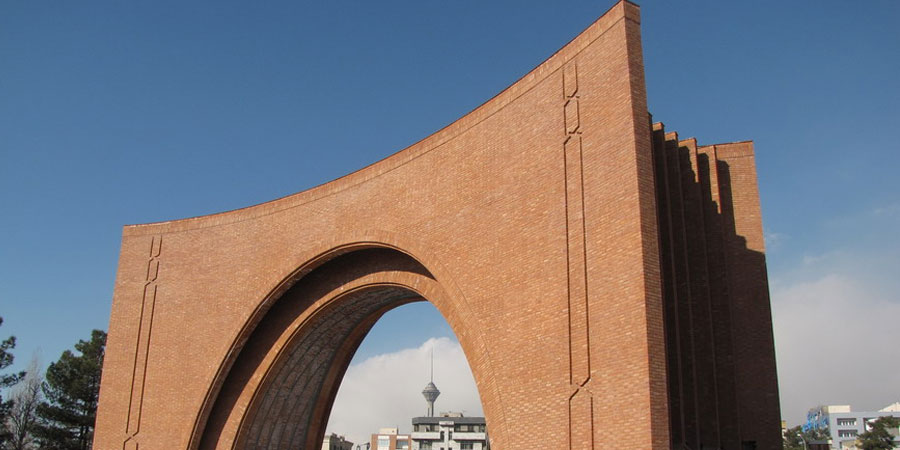

# Computational Physics | Tarbiat Modares University

## Course info

**Lecturer:** Dr. Malihe Ghodrat

**Date:** 2022
## Install requirements

### Installing Anaconda
Windows manual:
[Requirements](requirements.md)

## Course **8.12.1400**

you can download the course notebook from here:
[Notebook](codes/Lecture-1-Introduction-to-Python-Programming.ipynb)

> Note: we took this material from jrjohansson lecture on scientific-python-lectures, feel free to check the full version of the course from its Github link: [jrjohansson notebooks link](https://github.com/jrjohansson/scientific-python-lectures)
 
### Homework 0

**Start:** 9 Esfand 1400

**Due to:** 15 Esfand 1400

Notebook: [homework0](Homeworks/Homework_0_surname.ipynb)

